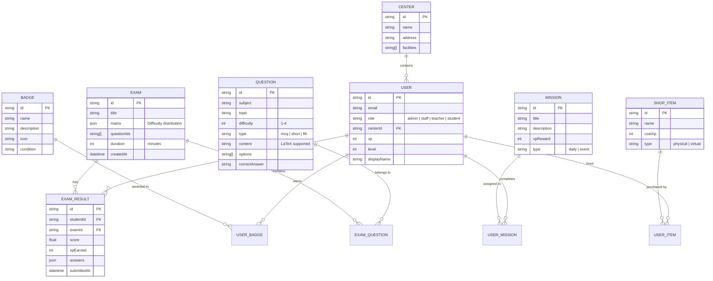

# Digital Knowledge Foundation (DKF) - LMS Design

## 1. Database Schema (Mermaid.js)



## 2. API Specification

### Auth & Admin
- `POST /api/auth/register`: Create a new user (Admin/Staff only).
- `POST /api/users/import`: Bulk import users from JSON/Excel.
- `GET /api/centers`: List all centers.

### Question Bank & Exams
- `POST /api/questions`: Add a new question (LaTeX supported).
- `POST /api/exams/generate`: Smart exam generation.
  - **Input**: `{ title: string, matrix: { diff1: number, diff2: number, ... }, subject: string }`
  - **Output**: `{ examId: string, questions: Question[] }`
- `POST /api/exams/submit`: Submit exam answers and calculate XP.

### Gamification
- `GET /api/student/xp`: Get current student XP and level.
- `GET /api/leaderboard`: Get top 10 students (Global/School/Class).
- `POST /api/shop/buy`: Purchase item with XP.

## 3. Interface Mockups

### Student Dashboard
- **Header**: User profile with XP bar, Level, and current Rank.
- **Main Section**:
  - **Daily Missions**: List of tasks (e.g., "Complete 10 Math questions").
  - **Active Exams**: List of assigned exams with countdown.
- **Sidebar**:
  - **Leaderboard**: Mini-view of top 5 students.
  - **Achievement Wall**: Grid of earned badges.
  - **XP Shop**: Button to open the store.

### Question Bank Management
- **Filter Bar**: Subject, Topic, Difficulty, Type.
- **Question List**: Table showing content (rendered LaTeX), difficulty, and actions.
- **Editor**:
  - Content field with live LaTeX preview.
  - Option management for MCQs.
  - Difficulty slider (1-4).
  - GIFT format import/export tool.

## 4. Code Skeleton (Logic)

### XP Calculation Logic
```typescript
function calculateXp(score: number, difficulty: number, timeSpent: number): number {
  const baseXP = 100;
  const difficultyMultiplier = [1, 1.2, 1.5, 2]; // For levels 1-4
  const scoreMultiplier = score / 10;
  
  return Math.floor(baseXP * difficultyMultiplier[difficulty - 1] * scoreMultiplier);
}
```

### Smart Exam Matrix Generator
```typescript
async function generateExam(matrix: Record<number, number>, subject: string) {
  const selectedQuestions = [];
  for (const [difficulty, count] of Object.entries(matrix)) {
    const questions = await db.collection('questions')
      .where('subject', '==', subject)
      .where('difficulty', '==', Number(difficulty))
      .limit(count)
      .get();
    selectedQuestions.push(...questions.docs.map(d => d.id));
  }
  return selectedQuestions.sort(() => Math.random() - 0.5);
}
```
